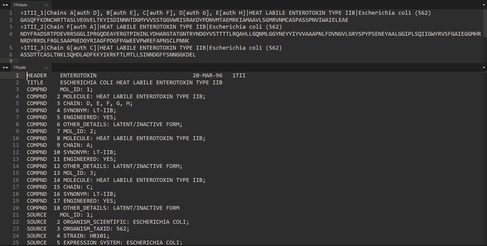

# PDBfetcher
A cross platform GUI app for windows and linux to download pdb or fasta files from Protein Data Bank by using pdb identifiers


### The GUI apps and input/output examples can be downloaded here: [](https://doi.org/10.5281/zenodo.7686299)

## Windows Dependences
Windows 10 version 1803 or later
To find the windows version of your machine go to the search bar and type:


then click on the winver program to see which windows 10 version do you have  

## linux Dependences
Install the curl tool by opening the terminal and pasting the following: 

```shell
sudo apt update
sudo apt install curl
```  
the input can be only 1 pdb id or a list of pdb ids as seen here:

 

while the output data can look like this:

 


